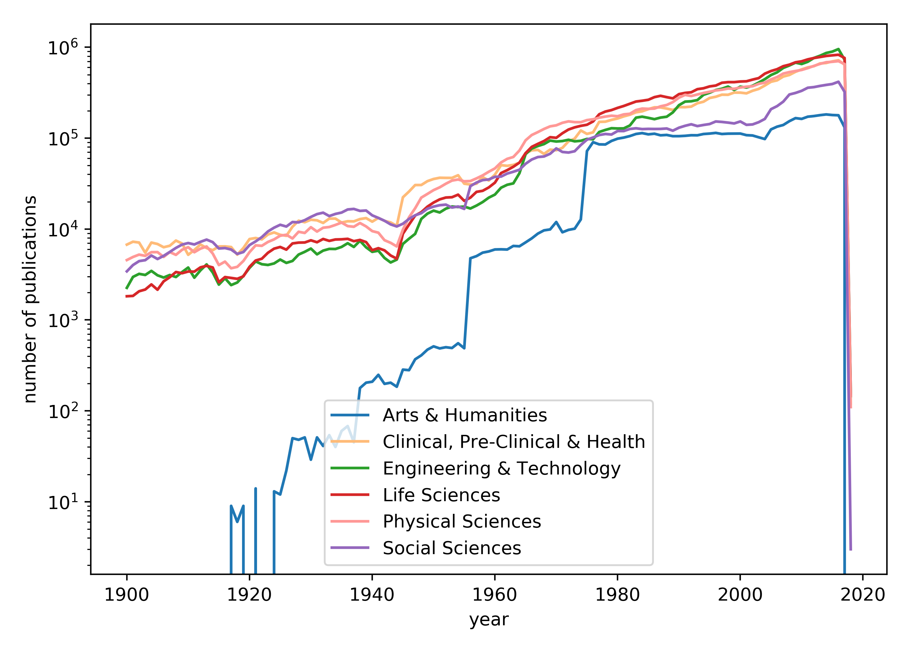

# WOS_data_processing

## 统计数据
------
总论文数/具有subject标签/teamsize：69,326,157/69,214,524/22,543,048

### 各领域论文每年论文数量

|year|Arts & Humanities|Clinical, Pre-Clinical & Health|Engineering & Technology|Life Sciences|Physical Sciences|Social Sciences|
|:---:|:---:|:---:|:---:|:---:|:---:|:---:|
|1950|512|35,534|15,930|19,559|26,802|17,648|
|1951|486|36,664|15,213|21,207|28,764|18,293|
|1952|501|36,547|16,750|22,218|31,518|18,557|
|1953|491|36,522|17,709|22,393|34,138|17,234|
|1954|554|39,084|17,476|23,896|35,082|17,709|
|1955|488|31,562|17,665|20,423|33,523|16,660|
|1956|4,770|30,872|16,819|22,167|33,739|29,649|
|1957|5,037|31,531|18,121|25,647|36,095|32,476|
|1958|5,499|37,253|19,813|26,337|38,918|34,543|
|1959|5,670|34,193|22,151|28,696|42,715|35,114|
|1960|5,961|39,633|23,937|32,383|46,455|37,545|
|1961|5,983|50,495|28,493|41,278|54,036|37,769|
|1962|5,951|49,588|30,690|44,453|59,196|40,776|
|1963|6,517|50,792|31,794|48,453|62,055|42,668|
|1964|6,461|53,696|41,158|53,814|73,151|44,971|
|1965|7,132|68,513|66,709|68,364|94,669|52,244|
|1966|7,893|73,408|76,775|80,187|108,245|58,207|
|1967|8,906|74,309|81,917|86,536|116,586|61,950|
|1968|9,670|67,106|86,052|92,944|126,201|62,859|
|1969|9,903|74,809|94,037|102,448|134,828|67,348|
|1970|11,952|73,587|91,842|100,875|138,409|77,130|
|1971|9,210|78,190|92,931|113,237|147,560|70,496|
|1972|9,793|92,328|95,962|124,454|153,049|69,443|
|1973|10,087|98,787|92,259|131,415|150,154|71,800|
|1974|12,751|121,492|93,509|136,592|149,822|84,078|
|1975|72,043|111,366|98,028|140,408|157,968|96,187|
|1976|90,306|115,836|97,223|152,613|161,237|101,716|
|1977|85,435|151,025|116,962|183,165|167,933|108,213|
|1978|85,187|151,792|123,136|196,166|172,704|111,172|
|1979|93,182|158,875|128,615|203,566|176,513|109,647|
|1980|98,694|164,603|127,766|215,366|174,240|119,825|
|1981|101,440|173,581|128,070|225,931|182,570|119,688|
|1982|105,444|181,028|137,888|239,121|185,330|126,188|
|1983|111,182|192,543|168,077|252,905|203,764|128,365|
|1984|113,663|197,381|172,270|257,935|211,561|125,817|
|1985|110,110|208,478|167,254|264,268|210,206|126,477|
|1986|111,901|218,531|161,741|282,666|211,639|126,184|
|1987|107,485|217,898|168,400|292,350|223,962|126,376|
|1988|108,497|211,645|172,031|282,575|231,635|127,770|
|1989|105,156|204,305|191,852|274,147|249,205|120,831|
|1990|105,219|219,535|230,550|305,065|278,913|130,295|
|1991|106,098|219,183|252,344|314,663|299,365|136,749|
|1992|107,668|222,416|254,522|319,666|290,824|142,117|
|1993|107,480|241,960|262,392|345,847|302,314|135,762|
|1994|111,060|251,662|299,646|353,794|314,009|139,641|
|1995|112,296|276,592|316,030|370,921|324,060|143,010|
|1996|114,249|285,454|338,010|379,131|334,859|152,607|
|1997|111,113|300,787|349,857|406,933|341,144|150,842|
|1998|112,050|300,086|369,419|413,414|351,377|148,251|
|1999|112,220|317,262|339,130|413,384|349,198|145,188|
|2000|112,350|316,903|368,639|419,825|360,536|152,656|
|2001|107,889|311,151|360,508|422,423|368,373|140,095|
|2002|106,979|332,112|377,258|440,750|372,633|141,589|
|2003|102,198|347,964|409,091|457,698|395,579|149,896|
|2004|97,760|379,367|445,662|512,723|408,453|162,718|
|2005|124,792|417,248|494,650|547,513|442,362|208,359|
|2006|133,840|432,688|529,937|573,616|469,981|225,149|
|2007|139,554|475,980|592,018|618,860|513,520|252,085|
|2008|153,773|495,781|630,414|643,739|533,055|302,188|
|2009|166,145|537,194|677,193|683,277|547,921|314,454|
|2010|162,839|570,662|654,320|700,535|562,930|331,634|
|2011|172,246|600,621|692,440|735,788|589,678|358,616|
|2012|175,043|619,212|762,766|761,581|623,565|364,443|
|2013|179,083|663,789|807,194|781,146|656,054|375,600|
|2014|182,376|671,553|865,138|802,375|684,169|385,303|
|2015|179,634|699,039|895,864|815,123|692,309|394,228|
|2016|178,528|719,167|955,585|827,443|703,425|417,489|
|2017|131,317|643,353|728,396|762,611|653,296|322,965|
|2018|0|120|145|148|110|3|
|total|5,361,562|16,493,933|17,869,205|20,368,543|18,053,623|9,814,173|

### 领域论文数量随时间变化图

## 领域相似度

### 相似度计算公式

$S_{ij} = \frac{R_{ij}+R_{j_i}}{\sqrt{(TC_{i}+TR_{i})(TC_{j}+TR_{j})}}$

(TC_{j}+TR_{j})}})

### 领域相似度矩阵
|subj|Arts & Humanities|Clinical, Pre-Clinical & Health|Engineering & Technology|Life Sciences|Physical Sciences|Social Sciences|
|:---:|:---:|:---:|:---:|:---:|:---:|:---:|
|Arts & Humanities|0.43957|0.00786|0.00838|0.00548|0.00486|0.08812|
|Clinical, Pre-Clinical & Health|0.00786|0.49220|0.10560|0.23119|0.02996|0.08877|
|Engineering & Technology|0.00838|0.10560|0.40222|0.16697|0.21588|0.06360|
|Life Sciences|0.00548|0.23119|0.16697|0.55937|0.12924|0.06881|
|Physical Sciences|0.00486|0.02996|0.21588|0.12924|0.61425|0.02560|
|Social Sciences|0.08812|0.08877|0.06360|0.06881|0.02560|0.50933|

